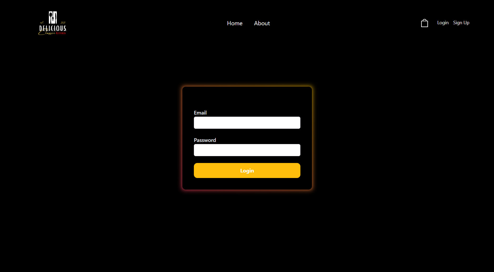
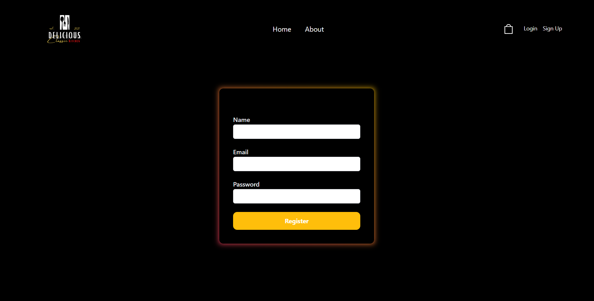
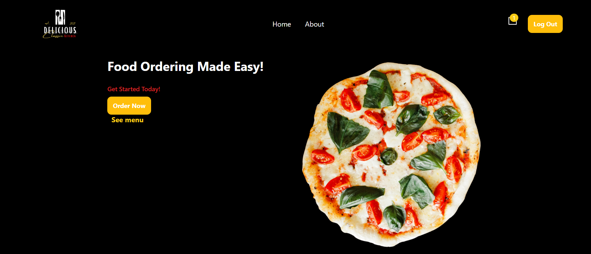
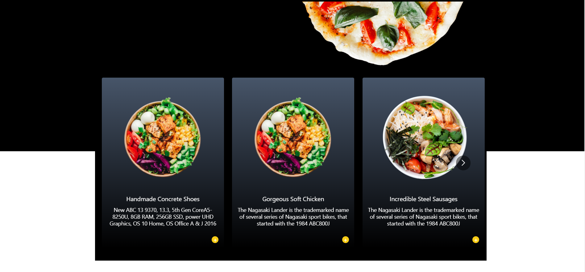
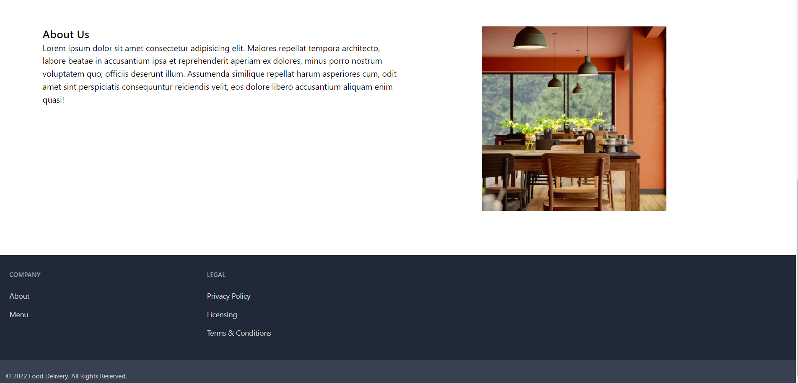
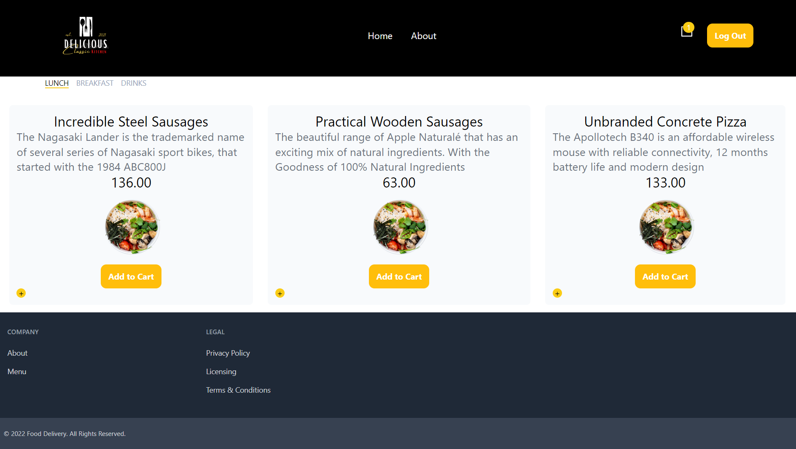
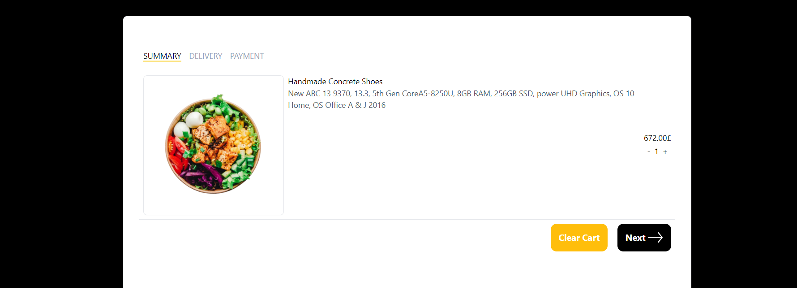
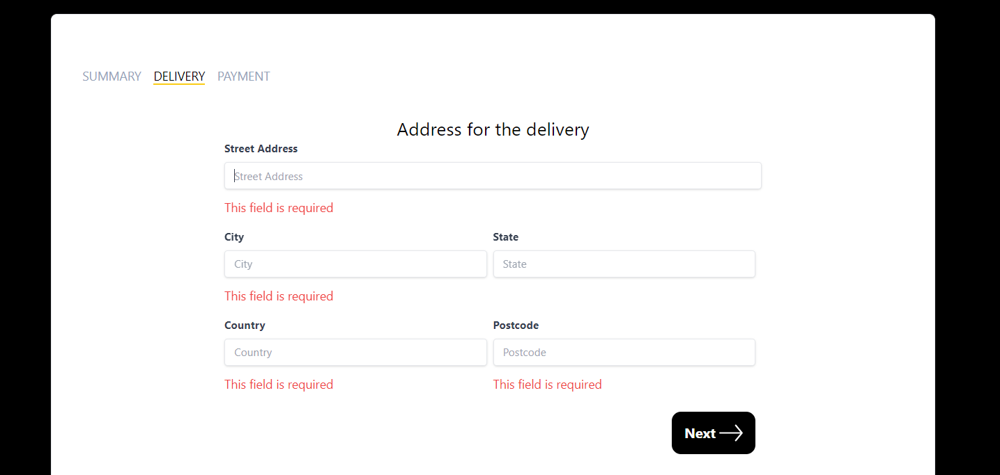
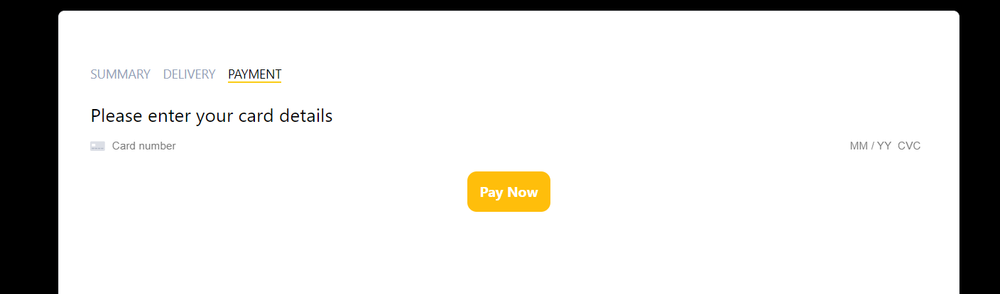

# Food Ordering System
Food Ordering System

# Functionalities
- Users can register and login using Firebase
- I have implemented a carousel functionality so that users can browse the menu
- Users can add or remove items to cart
- Users can enter a delivery address and prcoess payments using stripe
- Data stored in MongoDB
- Responsive and seamless user interface using Tailwind CSS

# Technologies
- Front-end: React, Redux, Tailwind CSS, Toastify
- Back-end: Node.js, Express, Mongoose, Stripe, Generated fake data by using Faker.js
- Database: MongoDB

    
    
  
